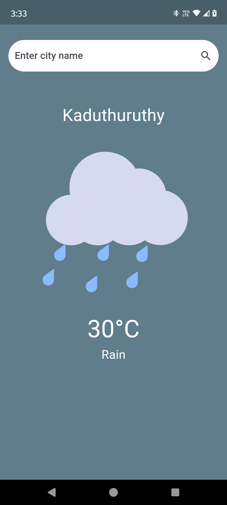
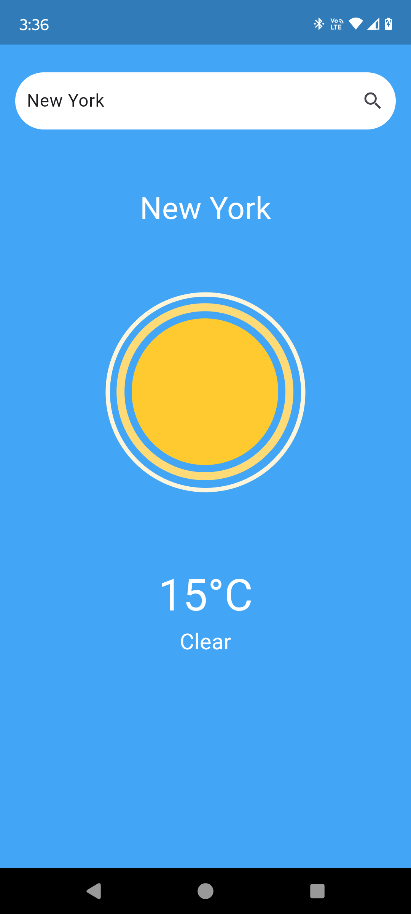
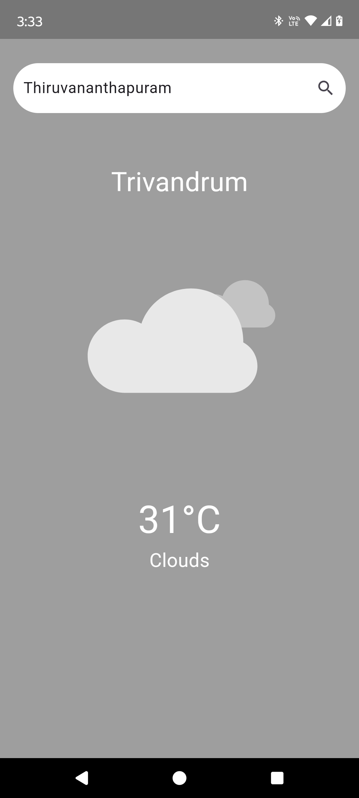

# Weather_app

## Description
The Weather App is a Flutter-based application that provides users with real-time weather information based on their location or a specified city. The app features a user-friendly interface, interactive animations, and accurate weather data powered by the OpenWeatherMap API.

## Features
- **Current Weather Data**: Displays the current temperature and weather conditions for your location or any city worldwide.
- **Dynamic Backgrounds**: Changes background color based on weather conditions (sunny, rainy, snowy, etc.).
- **Lottie Animations**: Engaging animations representing different weather conditions.
- **User Input**: Allows users to search for weather by city name.

## Screenshots




## Installation
1. Clone the repository:
   ```bash
   git clone https://github.com/yourusername/Weather_app.git
2. Navigate to the project directory
   ```bash
   cd Weather_app
3. Install dependencies
   ```bash
   flutter pub get
4. Run the app
   ```bash
   flutter run
## API Key
To use the weather data, sign up at OpenWeatherMap and replace the API key in weather_service.dart.

## Acknowledgements
- OpenWeatherMap for providing the weather data.
- Lottie for the animations.

